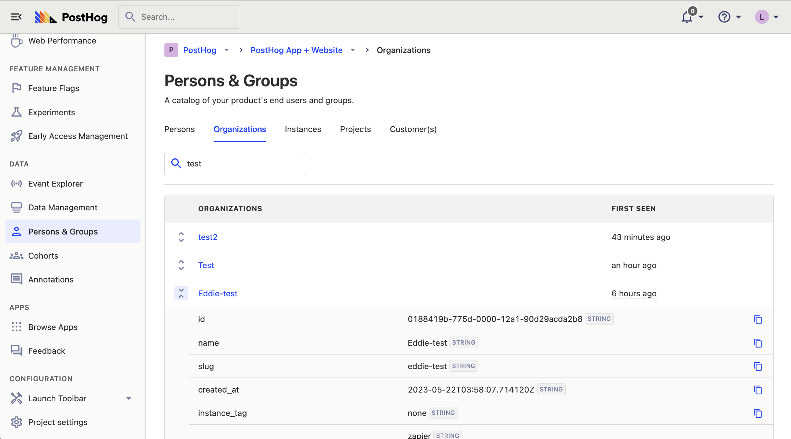
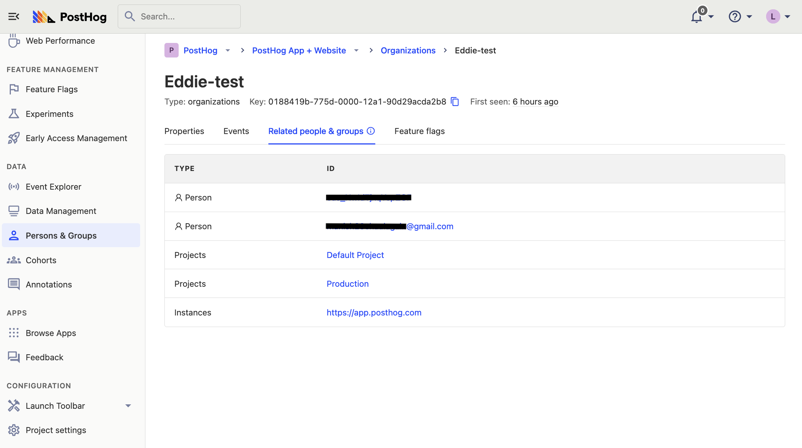
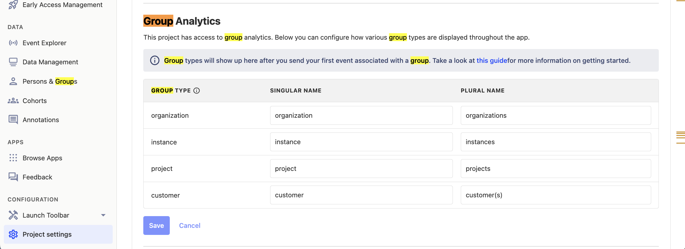

> **Note: ** This is a paid feature and is not available on the open source or free cloud plan. See our [pricing page](/pricing) for more.

**Groups** are a powerful feature in PostHog that aggregate events based on entities. They enable you to track trends, insights, and dashboards at an entity-level – as opposed to regular events, which only show you insights on a user-level.

To clarify what we mean, let's look at a few examples:

1. For B2B SaaS apps, you can create a *company* group type to aggregate events at a company-level. This enables you to calculate metrics such as `number of daily active companies`, `company churn rate`, or `how many companies have adopted a new feature`.

2. For a communication app like Slack, grouping events at a channel-level enables you to measure metrics like `average number of messages per channel`, `number of monthly active channels`, or `total number of channel participants`.

3. For a social media app like Twitter, events can be grouped at a tweet-level – enabling you to measure `average number of replies per tweet`, or `total count of unique tweeters per month`.

> Groups are often confused with [cohorts](/docs/data/cohorts), but they each serve different purposes:
>
> * Groups aggregate events, and do not necessarily have to be connected to a user.
> * Cohorts represent a specific set of users – e.g., a list of users that all belong to the same company.
> 
> Cohorts are easier to use and quicker to get started, whereas groups are more powerful. If your only goal is to create a list of **users** with something in common, we recommond cohorts instead of groups..

## How to create groups

Groups are created and defined in your code when sending events. 

In the example below, we create a group type `company`. Then, for each company, we set the `group key` as the unique identifier for that specifc company. This can be anything that helps you identify it, such as ID or domain.

> We advise against using the _name_ of the company (or any other group) as the key, because that's rarely guaranteed to be unique, and thus can affect the quality of analytics data.

<MultiLanguage>

```js
// All events for that session will be associated with company `company_id_on_your_db`
posthog.group('company', 'company_id_in_your_db');

posthog.capture('user_signed_up')
```

```python
posthog.capture('[distinct id]', 'user_signed_up', groups={'company': 'company_id_in_your_db'})
```

```go
client.Enqueue(posthog.Capture{
    DistinctId: "[distinct id]",
    Event: "user_signed_up",
    Groups: posthog.NewGroups().
        Set("company", "company_id_in_your_db").
})
```

```node
posthog.capture({
    event: 'user_signed_up',
    distinctId: '[distinct id]',
    groups: { company: 'company_id_in_your_db' }
})
```

```php
PostHog::capture(array(
    'distinctId' => '[distinct id]',
    'event' => 'user_signed_up',
    '$groups' => array("company" => "company_id_in_your_db")
));
```

```segment
// You'll always need to pass through the $groups object for Segment, even for analytics.js
analytics.track('user_signed_up', {
    $groups: { segment_group: 'company_id_in_your_db' }
})
```

</MultiLanguage>

> **Tip:** When specifying the group type, use the singular version for clarity (`company` instead of `companies`).

We now have one `company`-type group with a key `company_id_in_your_db`. When we send the event `user_signed_up`, it will be attached to this newly created group.

Note that a single event can only belong to a single group per group type. To elaborate on what we mean, we'll continue using the example above:

* It is **NOT** possible to assign the a single `user_signed_up` event to two companies at the same time.
* It is possible to assign this event to a different group type, for example `channel` or `tweet`, in addition to the `company` group type.

<MultiLanguage>

```js
// ❌ Not possible
posthog.group('company', 'company_id_in_your_db');
posthog.group('company', 'another_company_id_in_your_db');
posthog.capture('user_signed_up')

// ✅ Allowed
posthog.group('company', 'company_id_in_your_db');
posthog.group('channel', 'channel_id_in_your_db');
posthog.capture('user_signed_up')

```

```python
# ❌ Not possible
posthog.capture('[distinct id]', 'user_signed_up', groups={'company': 'company_id_in_your_db', 'company': 'another_company_id_in_your_db'})

# ✅ Allowed
posthog.capture('[distinct id]', 'user_signed_up', groups={'company': 'company_id_in_your_db', 'channel': 'channel_id_in_your_db'})
```

```go
// ❌ Not possible
client.Enqueue(posthog.Capture{
    DistinctId: "[distinct id]",
    Event: "user_signed_up",
    Groups: posthog.NewGroups().
        Set("company", "company_id_in_your_db").
        Set("company", "another_company_id_in_your_db").
})

// ✅ Allowed
client.Enqueue(posthog.Capture{
    DistinctId: "[distinct id]",
    Event: "user_signed_up",
    Groups: posthog.NewGroups().
        Set("company", "company_id_in_your_db").
        Set("channel", "channel_id_in_your_db").
```

```node
// ✅ Allowed
posthog.capture({
    event: 'user_signed_up',
    distinctId: '[distinct id]',
    groups: { 
        company: 'company_id_in_your_db',
        channel: 'channel_id_in_your_db'
    }
})
```

```php
// ❌ Not possible
PostHog::capture(array(
    'distinctId' => '[distinct id]',
    'event' => 'user_signed_up',
    '$groups' => array("company" => "company_id_in_your_db", "company" => "another_company_id_in_your_db")
));
// ✅ Allowed
PostHog::capture(array(
    'distinctId' => '[distinct id]',
    'event' => 'user_signed_up',
    '$groups' => array("company" => "company_id_in_your_db", "channel" => "channel_id_in_your_db")
));
```
</MultiLanguage>


> **Group type limit:** There's a hard limit of 5 group types within PostHog, although within each group type you can have an unlimited number of groups.

### Setting and updating group properties

In the same way that every user can have [properties](/docs/getting-started/user-properties) associated with them, every group can have properties associated with it.

Continuing with the previous example of using `company` as our group type, we'll add `company_name`, `date_joined`, and `user_count` as additional properties.

> **Note:** You must include at least one group property for a group to be visible in the "Persons & Groups" tab

<MultiLanguage>

```js
posthog.group('company', 'company_id_in_your_db', {
    name: 'PostHog',
    user_count: 33,
    date_joined: '2020-01-23T00:00:00.000Z'
});
```

```python
posthog.group_identify('company', 'company_id_in_your_db', {
    'name': 'PostHog',
    'user_count': 33,
    'date_joined': '2020-01-23T00:00:00.000Z'
})
```

```go
client.Enqueue(posthog.GroupIdentify{
    Type: "company",
    Key:  "company_id_in_your_db",
    Properties: posthog.NewProperties().
        Set("name", "PostHog").
        Set("user_count", 33).
        Set("date_joined", "2020-01-23T00:00:00.000Z"),
})
```

```node
posthog.groupIdentify({
    groupType: 'company',
    groupKey: 'company_id_in_your_db',
    properties: {
        name: 'PostHog',
        user_count: 33,
        date_joined: '2020-01-23T00:00:00.000Z'
    }
})
```

```php
PostHog::groupIdentify(array(
    'groupType' => 'company',
    'groupKey' => 'company_id_in_your_db',
    'properties' => array("name" => "PostHog", "user_count" => 11, "date_joined": "2020-01-23T00:00:00.000Z")
));
```

```segment
analytics.group('company_id_in_your_db', {
    "name": "PostHog",
    "user_count": 33,
    "date_joined": "2020-01-23T00:00:00.000Z"
})
```

</MultiLanguage>

Properties on groups behave in the exact same way as properties on [persons](/docs/data/persons). They can also be used within experiments and feature flags to rollout features to specific groups.

> **Note:** The PostHog UI identifies a group using the `name` property. If the `name` property is not found, it falls back to the group key.

For more on implementing group analytics, check out our [guide on frontend vs backend group analytics implementations](/tutorials/frontend-vs-backend-group-analytics).

## Using groups in PostHog

Now that we have created our first group type, we can take a look at how to use groups within PostHog.

### Viewing groups and their properties

To view groups and their properties, head to the "Persons and Groups" tab on the navigation bar.

From here you can select the group type you are interested in and view the groups and properties (by clicking the chevrons on the left).



You can also click on a specific group to see information such as all the events that have been sent by this group. From there, in the "Related people & groups" tab, you can also see all of the persons who have sent events that were associated with this group, as well as all the other groups associated with the events.



### How to view group insights
You can use groups in [insights](/docs/product-analytics/insights) to view aggregated events based on group type.

For example, let's say that we wanted to see a graph showing how many different organizations have signed up recently:

To do this, expand the menu next to the event you've chosen. This will a list of all the group types you have available. Then, by selecting "Unique organizations", this will show us a graph with the total number of organizations that have signed up (as opposed to individual users).


### Using groups with funnels

Another place where group analytics can be used is within funnels.

For example, you may want to understand how an organization moves from their first visit to eventually signing up. Yo can do this by setting the 'Aggregating by' field to 'Unique organizations'.

This will show how many organizations have made it through, as well as the percentage of organizations that dropped off. It's also possible to see exactly which specifc groups dropped off at each step.


### Using groups with feature flags

Groups in feature flags enable you to rollout a feature by group type (like `company`), instead of users.

To do this, create a feature flag as you normally would, except you need to select the group type you wish to "Match by", using the drop down in the "Release conditions" section:


You will also need to update your event tracking code in order for the feature flag to be able to determine the groups of the current user.

<MultiLanguage>

```js
// Make sure you have called posthog.group() earlier in that session

if (posthog.isFeatureEnabled('new-groups-feature')) {
    // Do something
}
```

```python
if posthog.feature_enabled("new-groups-feature", "[distinct id]", groups={"company": "company_id_in_your_db"}):
    # Do something
```

```php
if (PostHog::isFeatureEnabled('new-groups-feature', '[distinct id]', false, array("company" => "company_id_in_your_db"))) {
    // Do something
}
```

```node
const isFlagEnabled = await posthog.isFeatureEnabled('new-groups-feature', '[distinct id]', false, { company: 'company_id_in_your_db' })

if (isFlagEnabled) {
    // Toggle feature-flag specific behavior
}
```

</MultiLanguage>

### Renaming group types

You can change how group types are displayed in your Insights interface and throughout PostHog by using the Project settings.




## Limitations

-   A maximum of 5 group types can be created per project.
-   Multiple groups of the same type cannot assigned to a single event (e.g., Company A & Company B).
-   Groups are not currently supported for the following insights:
    -   Lifecycle - Expected soon.
    -   User Paths - These only support user level analytics.
-   Only groups with known properties are shown under 'Persons & groups'.
-   Currently there is no functionality within the app to delete groups. If you'd like to delete a group, please [contact customer support](/growth/customer-support#we-aim-to-delight).

## Further reading

- [Frontend vs Backend Group Analytics](/tutorials/frontend-vs-backend-group-analytics).
- [When and how to run group-targeted A/B tests](/blog/running-group-targeted-ab-tests)
